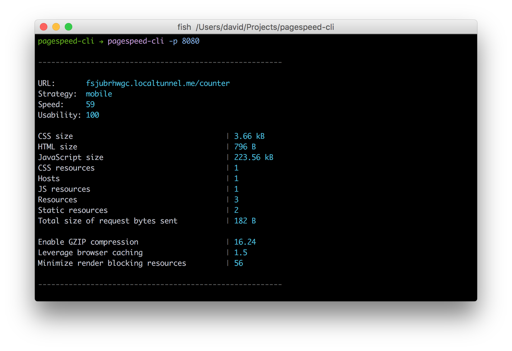

### :boom: Careful: This package is no longer maintained and is only here for historic reasons. This means you should very likely not use it. You have been warned. :boom:

---

# pagespeed-cli

> Getting Google PageSpeed Insights for a app running locally - directly in the command line

[`psi`](https://github.com/addyosmani/psi) + [`localtunnel`](https://github.com/localtunnel/localtunnel) = :heart:



## Install

```bash
npm install pagespeed-cli
```

## Usage

```bash
# For a example app running on localhost, port 8080
pagespeed-cli -p 8080

# For a example app running on localhost, port 8080 and with desktop strategy
pagespeed-cli -p 8080 -s desktop
```

## Debugging

This module uses [debug](https://github.com/visionmedia/debug).

```bash
DEBUG='pagespeed-cli' pagespeed-cli -p 8080
```

## Licence

MIT
